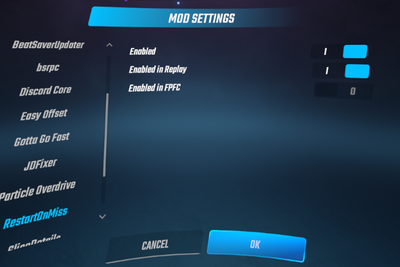

# RestartOnMiss

---
### What is this mod?
This mod was something I thought of while grinding a map to FC (I kept missing one or two notes) So of course I looked around for something similar and found nothing...
so I made this!

This mod is best thought of as _1 life_ or _4 lives_ **but much more** customizable!

## Features

- Reset on a customizable amount of misses
- Decide whether to count bad cuts as misses
- Decide whether to count hitting bombs as misses

## Known issues/quirks
- :warning: On **1.29.1** there is an issue where your score **WILL NOT** submit if you use BetterNoFail (has not been an issue on other versions)
- This mod restarts the game before BeatLeader or CountersPlus register the last miss, bomb hit, or bad cut  
meaning that it will show one less than you actually had upon restarting (or in BeatLeaders case will show the incorrect amount when looking at the unfinished replay)

## Pictures!

## Planned features

###### For the record these are not guaranteed to come, however I'm very interested in them and looking making them happen :)

###### Also, you would be able to enable/disable these

- Automatically set the value to your PB (based on settings ex bomb hits included) and select which scoreboard it comes from (or pick the lower/higher value)
- Automatically disable if you have not played the song before

## Extra Settings
By default, the mod is disabled in FPFC and in replays. If for some reason you'd like to change that (which I do not recommend) you can find them in Settings -> Mod Settings -> RestartOnMiss

###### be warned there is a way to soft lock the game if you press esc or exit a play/replay at just the right time in fpfc

## Credits

- [Meivyn](https://github.com/Meivyn)
- [CountersPlus](https://github.com/NuggoDEV/CountersPlus/)
- [JDFixer](https://github.com/zeph-yr/JDFixer)
- Their respective contributors
- And the BSMG community

### Testers
- [Barracuda312](https://www.twitch.tv/barracuda312)
- [snoww](https://scoresaber.com/u/76561199168973689)

## Final notes

If you encounter any bugs or unexpected behaviors other than the beatleader/misscounter quirk please either open an issue here or dm me on discord @ smoothbutter :thumbsup:

If you'd like to contribute I welcome you to do so, feel free to open an issue or a pr!

